# Getting a bearer token

In order to get a bearer token for the Twitter V2 API, you'll need to set up an application on the developer dashboard. This is a free process that will give you a key and permission to query 50,000 tweets per month.

## Create a developer account

First, head over to the [Twitter developer dashboard](https://developer.twitter.com/en/portal/dashboard). If you're not logged in to your Twitter account (or if you don't have one yet), you'll be prompted to login or create an account.

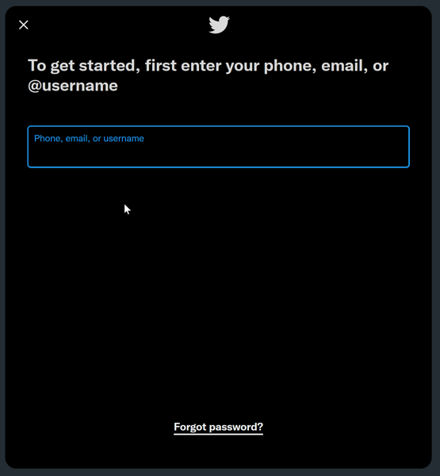

Next, you'll be asked to choose your use case. I recommend choosing Hobbyist; if you choose Professional or Academic, Twitter will try to upsell you to their paid API access.

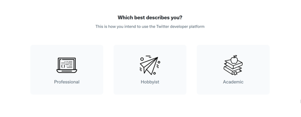

When the submenu appears, choose Exploring the API. Then click **Get Started**.

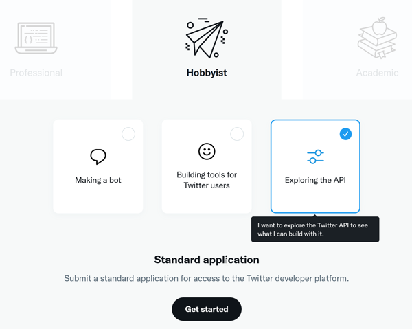

Next, Twitter will have you fill out a form with basic information to set up your developer account. At the top you'll see your Twitter account and email address, and at the bottom you'll be asked for your name. There is also a dropdown that asks for your coding skill level. You can answer however you like! Twitter just uses this to determine how much information to show you later on.

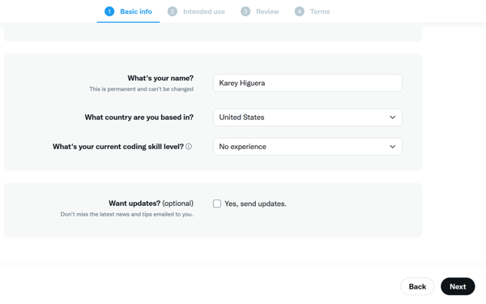

Twitter will then ask how you plan to use the API. You can use the following explanation if you like, or come up with your own (it just needs to be at least 200 characters).

> I will be using the API in conjunction with the Tweet to Markdown tool in order to save the text and images of tweets into the Obsidian note taking application for archival purposes. This will be entirely for personal use.

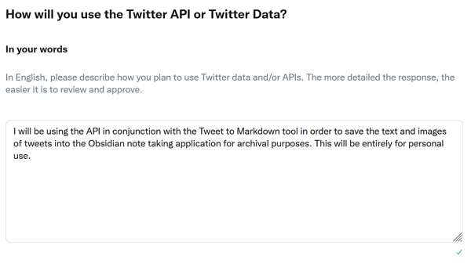

You can also turn off all of the toggles that follow this text box.

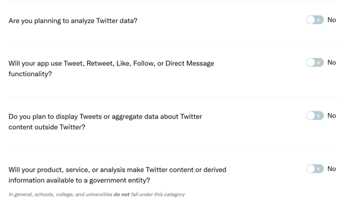

On the next two pages you'll be asked to review the information you've provided and to accept the developer agreement policy and terms of use of the API. Once you do so, go ahead and click **Submit Application**! You might see a screen asking you to verify your email address.

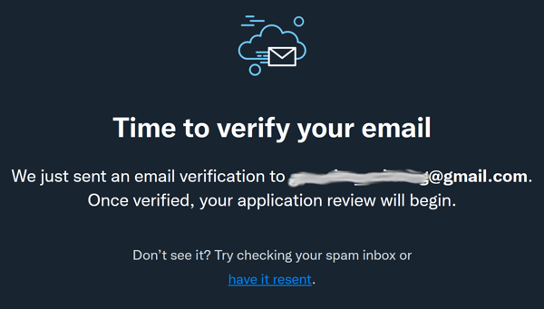

## Set up bearer token
Once you've submitted you developer application and verified your email address, you'll see the developer dashboard. Click on **Create project**.

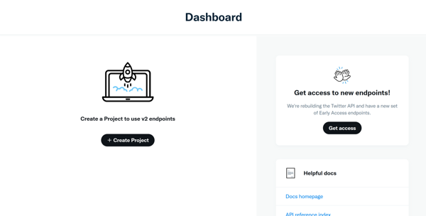

Twitter will then walk you through setting up a project. First, set a name for the project. This is mainly to help you keep track of what this bearer token will be used for, in case you ever set up others.

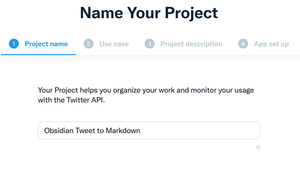

Next, Twitter will again ask about your use case. You can choose *Exploring the API*.

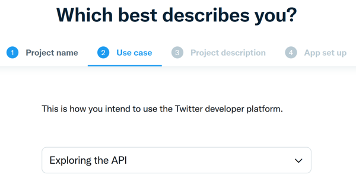

Then, you'll need to set a project description. You can write your own or use the same one we used earlier.

> I will be using the API in conjunction with the Tweet to Markdown tool in order to save the text and images of tweets into the Obsidian note taking application for archival purposes. This will be entirely for personal use.

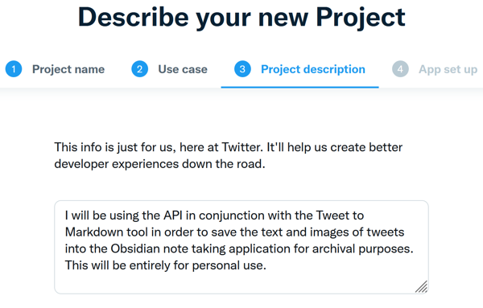

Once you've filled out the project details, you will need to set an App name. This app name will need to be globally unique. How about `<your name> + Tweet to Markdown`?

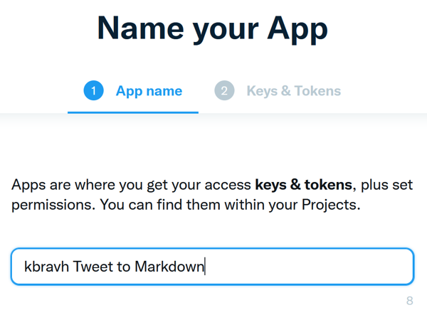

Finally, Twitter will show your API access information! For this project, you'll only need the bearer token in the last box.

Nota bene: Save this information somewhere safe! If you leave this page before saving your key, you'll have to generate a new one. If you ever need to generate a new key, click on *Keys and tokens* under your app name and click **Regenerate** next to the bearer token box.

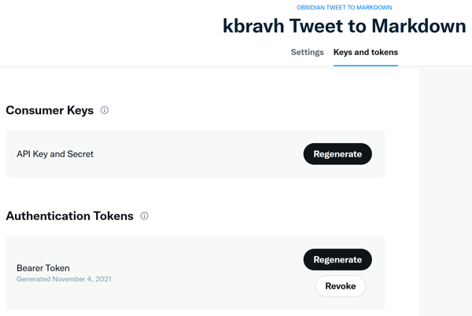

## Success!

Congratulations! You now have a Twitter bearer token that you can use with Tweet to Markdown.
