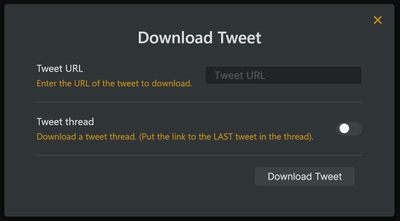
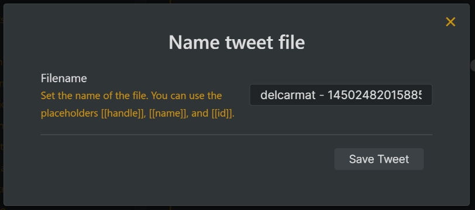
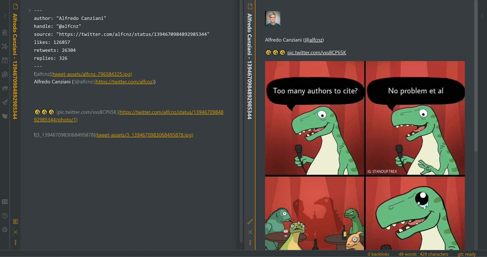

 

  

  <h3 align="center">Tweet to Markdown</h3>

  

    An Obsidian plugin to quickly save tweets as Markdown.
     
     
    <a href="https://github.com/kbravh/obsidian-tweet-to-markdown/issues">Report a Bug</a>
    ·
    <a href="https://github.com/kbravh/obsidian-tweet-to-markdown/issues">Request a Feature</a>
  

<!-- ABOUT THE PROJECT -->

## About The Project

This plugin allows you to quickly save a tweet in Markdown format. It is built on the new Twitter v2 API.

## Installing

Find this plugin in the listing of community plugins in Obsidian and add it to your application.

Or, if you'd like to install it manually, clone this repository to the `.obsidian/plugins/` directory in your vault, navigate to your newly cloned folder, run `npm i` or `yarn` to install dependencies, and run `npm run build` or `yarn build` to compile the plugin.

<!-- USAGE EXAMPLES -->

## Usage

### Bearer token
To use this tool, you'll need to set up an application and get a bearer token on the [Twitter developer dashboard](https://developer.twitter.com/en/portal/dashboard). For a guide on doing so, see [Getting a bearer token](BearerTokenGuide.md). Once you have the bearer token, you can paste it into the bearer token field on the Tweet to Markdown settings page. If you'd rather protect the token a bit more, you can store it in the environment variable `TWITTER_BEARER_TOKEN`.

Nota bene: On Unix machines, make sure to set this in your profile file (such as `~/.bash_profile`) so that it will be available to Obsidian.

### Downloading a tweet

Either click the Twitter logo in your sidebar or run the command `Download Tweet from URL` from the command palette. Then, just paste in the link to a tweet and click download.

To download a tweet thread, paste the link to the **LAST** tweet in the thread, and toggle the Thread switch.

Once the tweet is downloaded, you'll be presented a window to set the name of the file that will be created. You can use the variables `[[handle]]`, `[[name]]`, and `[[id]]` when naming your file, which will be automatically replaced with the author's handle, name, and the tweet ID.

The tweet will be saved to a Markdown file in the root of your vault, or in the directory specified in your settings. Here's how the tweet will look:

Any attached images, polls, and links will also be linked and displayed in the file.

## Options

On the Tweet to Markdown settings page in Obsidian, you can customize the way the plugin works to better match your vault structure and workflow.

### Custom File Name

Tweets are, by default, saved with the filename `[[handle]] - [[id]].md`. You can instead enter your own format in the **Filename** field using the variables `[[name]]`, `[[handle]]`, and `[[id]]` in your filename, which will automatically be replaced. The file extension `.md` will also be added.

### Custom File Path

To save the tweet to a place other than the root of your vault, type a new path in the **Note Location** field. If this path doesn't exist, it will be recursively created.

### Save Images Locally

Want to really capture the entire tweet locally? You can flip the **Download images** switch to download all the tweet images as well, instead of just linking to the images on the web. If the tweet is ever deleted or Twitter is unavailable, you'll still have your note.

Tweet images will be automatically saved to the directory `tweet-assets/`. If you'd like to save the assets to a custom directory, type that directory in the **Image location** field.

Nota bene: Unfortunately, there is currently not a way to retrieve gifs or videos from tweets using the v2 API.

<!-- CONTRIBUTING -->

## Contributing

Contributions are what make the open source community such an amazing place to learn, inspire, and create. Any contributions you make are **greatly appreciated**.

## License

This project is licensed under the MIT License - see the [ `LICENSE` ](LICENSE) file for details

<!-- CONTACT -->

## Contact

Karey Higuera - [@kbravh](https://twitter.com/kbravh) - karey.higuera@gmail.com

Project Link: [https://github.com/kbravh/obsidian-tweet-to-markdown](https://github.com/kbravh/tweet-to-markdown)
